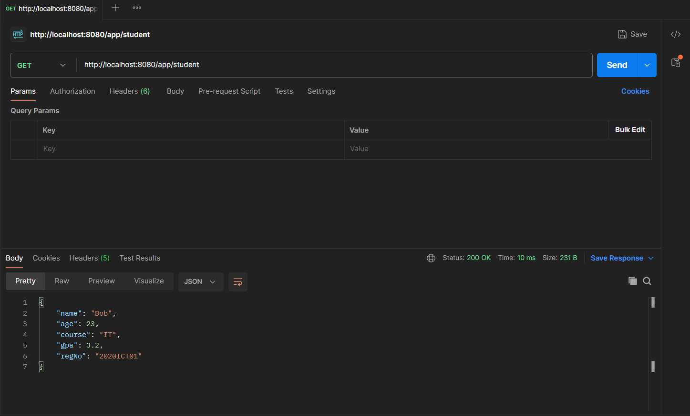
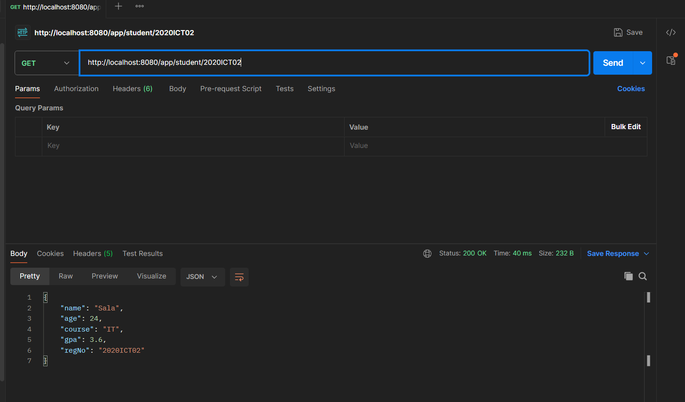
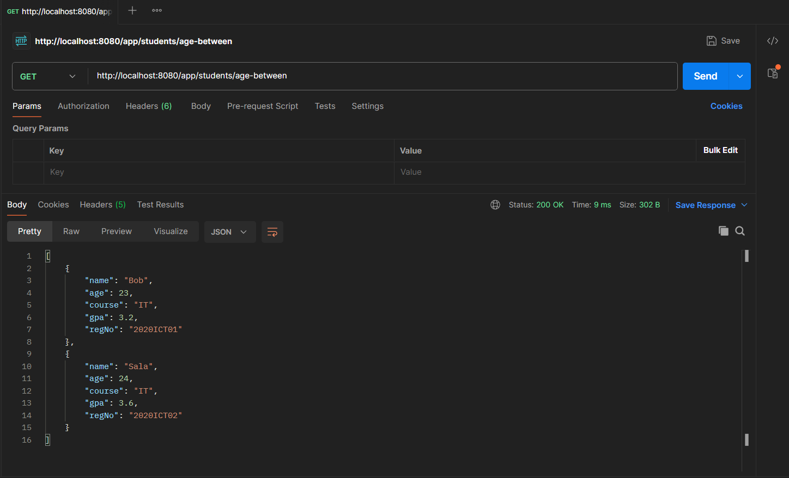
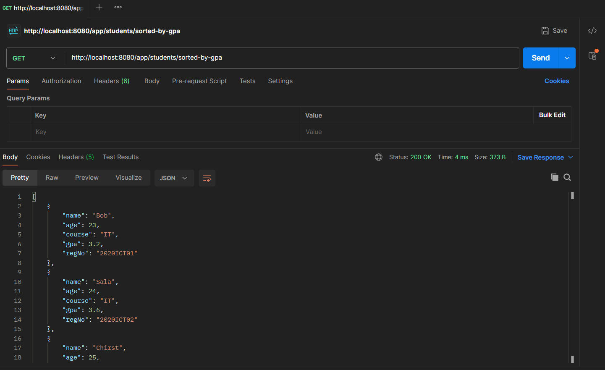
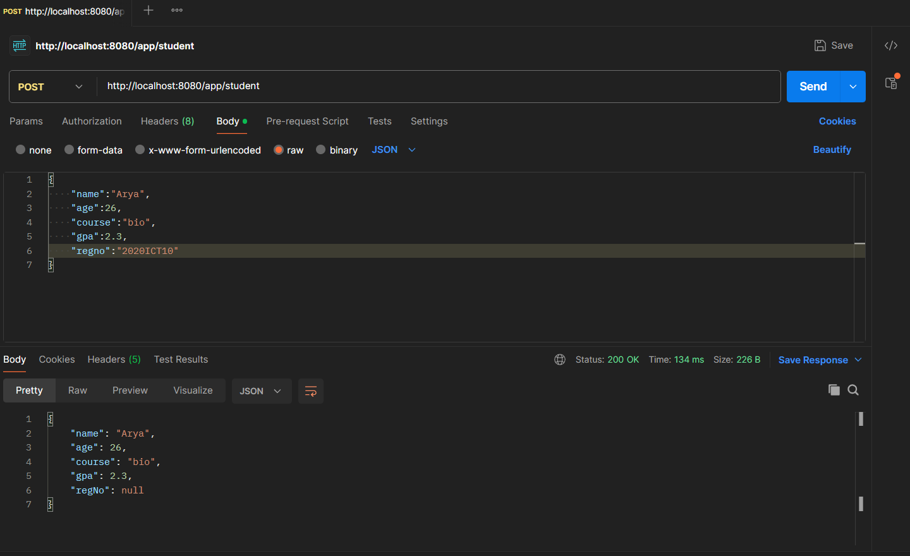
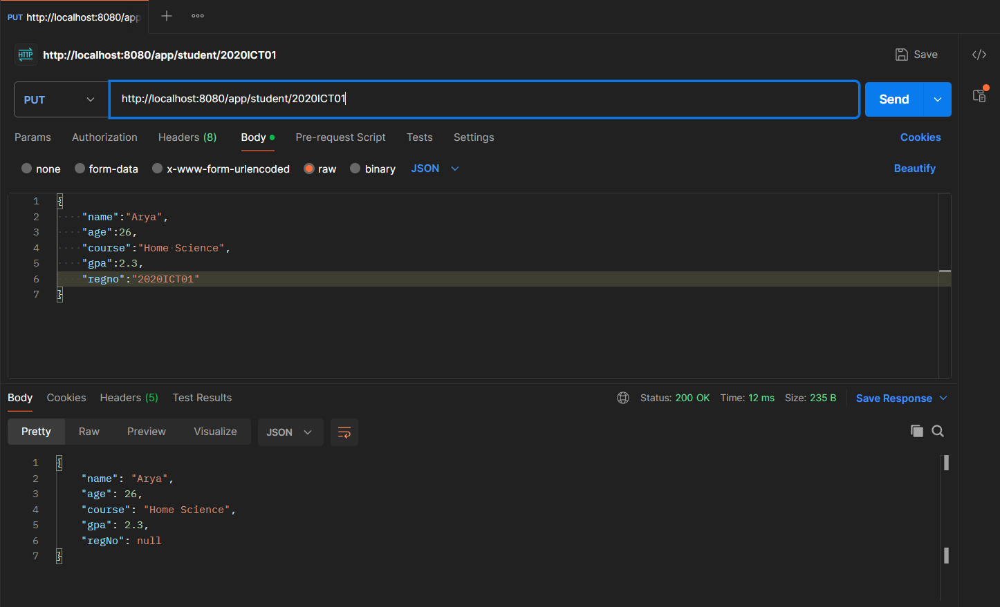
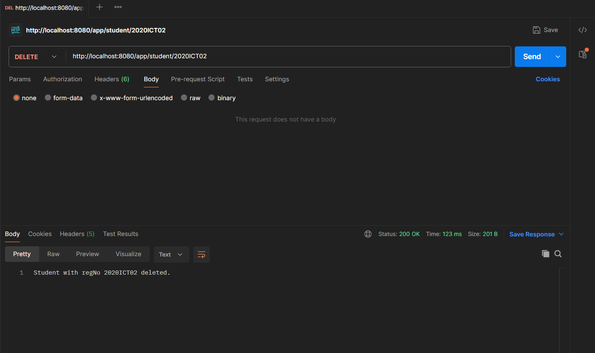

# Practical-Day3

# outputs

**Get a Single Student**

**Get Multiple Students**

**Find a Student by Registration Number**

**Find Students by Age Range (20-24)**

# CRUD
**Create Student**

**Update Student**

**Delete Student**

